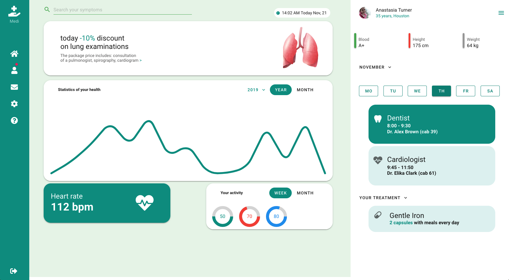

# Vuetify Health Dashboard
This project is based on an ["AAE IdeaPro" Vuetify tutorial](https://www.youtube.com/watch?v=GAo_kUyhQzw).

## Project Overview

This is a health dashboard that shows off several Vuetify components. However, this is a design exercise only. It means that there is no behaviour in this app. In addition, all code is in one single page - no components. Checkout other branchs to see the evolution of this project.

### Main Screen



The main page consists of three parts: a side bar, the main dashboard, and the user dashboard.

## Branch Features

This branch replaces a few Vuetify components with more appropriate ones.

- __Rounded cards__ now use only one instrution to round all four corners;
- __Simulated dropdowns__ now use the __autocomplete__ component;
- __User identification__ on the top of the left-hand side now uses a toolbar instead of a __list__ structure;
- __User metrics__ now use an __alert__ component instead of an elaborated structure with cards;

In addition, we added descriptions to sidebar icons.

## Project setup
```
yarn install
```

```
yarn serve
```